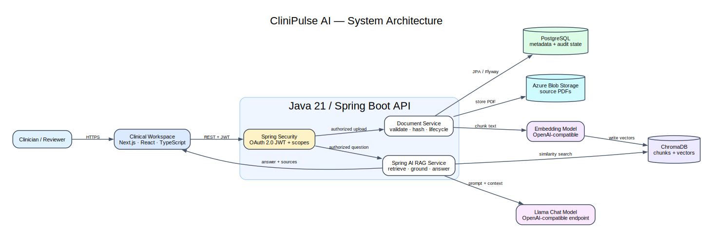

# High-Level Design

## Goals

CliniPulse accepts clinical PDFs, validates and stores them safely, indexes their text for retrieval, and answers questions only from retrieved document context. The design separates the user experience, transactional metadata, object storage, vector retrieval, and model inference so each can scale and be secured independently.

## System boundaries

| Component | Technology | Responsibility |
|---|---|---|
| Clinical workspace | Next.js, React, TypeScript | Uploads, document inventory, grounded chat, analytics, and access requests |
| API and policy boundary | Java 21, Spring Boot, Spring Security | REST APIs, validation, OAuth 2.0 JWT scopes, orchestration, and error handling |
| Metadata store | PostgreSQL, JPA, Flyway | Document identity, SHA-256 digest, storage key, state, actor, and timestamps |
| Source-document store | Azure Blob Storage; Azurite locally | Durable encrypted PDF object storage |
| Retrieval store | ChromaDB through Spring AI | Embedded chunks and similarity search |
| Model services | Spring AI OpenAI-compatible clients | Embeddings and grounded chat against a Llama-compatible endpoint |

## Document lifecycle

1. The API enforces authentication, authorization, content type, PDF signature, and the 25 MB request limit.
2. `MedicalDocumentService` computes SHA-256 and rejects duplicate content.
3. The source PDF is stored under an actor-scoped UUID key in Azure Blob Storage.
4. Metadata is persisted in PostgreSQL with status `STORED`.
5. `RagDocumentIndexer` extracts and chunks text, generates embeddings, and writes chunks to ChromaDB.
6. Metadata transitions to `READY`; indexing failures transition to `FAILED` without hiding the durable source record.

## Retrieval and answer path

`MedicalRagService` performs top-five similarity search with a 0.6 threshold. Spring AI's question-answer advisor supplies the retrieved context to the configured chat model. The system prompt requires evidence-grounded answers, explicit uncertainty, minimal PHI exposure, and no diagnosis or prescribing.

## Data ownership

| Data | System of record | Recovery concern |
|---|---|---|
| PDF bytes | Azure Blob Storage | Versioning, encryption, retention, and disaster recovery |
| Document metadata and status | PostgreSQL | Transactional backups and Flyway-controlled schema |
| Searchable chunks and vectors | ChromaDB | Rebuildable from source PDFs; snapshot for faster recovery |
| Generated answer | Returned to client | Persist only under an explicit audited retention policy |

## Security and privacy

- OAuth 2.0 resource-server validation and scope-based endpoint authorization.
- Restricted CORS and disabled-security mode limited to local development.
- Server-side PDF validation, size limits, content hashing, and duplicate detection.
- Actor-scoped object names and no secrets in the browser bundle.
- Production controls should add private networking, managed identity, customer-managed keys, immutable audit export, PHI-safe logs, malware scanning, and access reviews.

## Scaling and resilience

- Keep the Spring API stateless and scale replicas behind a load balancer.
- Move extraction and embedding to an asynchronous queue for large documents or burst traffic.
- Apply idempotency with SHA-256 plus document ID so retries do not duplicate blobs or vectors.
- Use PostgreSQL connection pooling, Chroma collection partitioning, and model concurrency limits.
- Reconcile `STORED` or `FAILED` rows with blob/vector state through a repair job.
- Bound model timeouts and return retrieved sources even when generation is unavailable.

## Deployment

`compose.yaml` runs the web app, API, PostgreSQL, ChromaDB, and Azurite. Production replaces local services with managed PostgreSQL, Azure Blob Storage, a durable vector service, and a secured OpenAI-compatible model endpoint while retaining the same logical boundaries.
