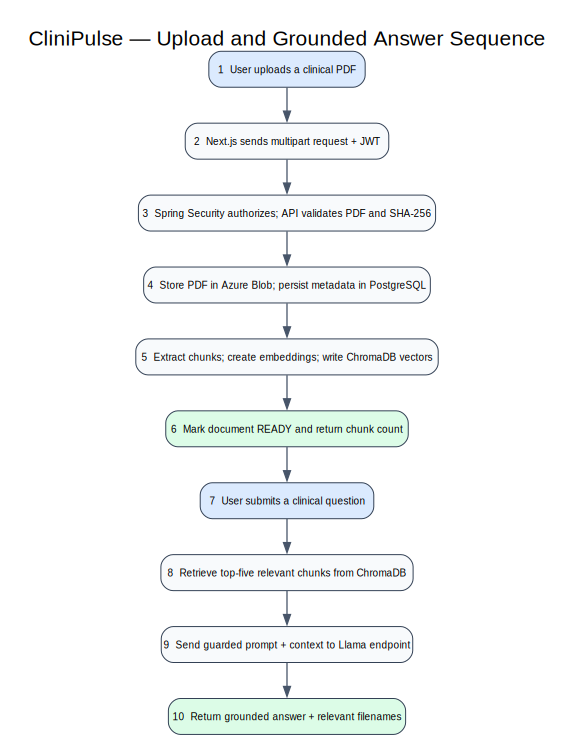

# Document and RAG Sequence

## A. PDF ingestion

1. The user selects a PDF in the Next.js workspace.
2. The browser posts multipart content with the bearer token.
3. Spring Security validates identity and scope before the controller runs.
4. The service validates the PDF, computes SHA-256, and checks PostgreSQL for duplicates.
5. The service writes the PDF to Azure Blob Storage and records metadata.
6. Spring AI extracts chunks, creates embeddings, and stores them in ChromaDB.
7. The metadata state becomes `READY`, and the UI receives the document plus chunk count.

## B. Grounded question answering

1. The browser posts a clinical question.
2. `MedicalRagService` searches ChromaDB for the five closest chunks above the similarity threshold.
3. Spring AI sends the policy prompt, question, and retrieved context to the Llama-compatible chat endpoint.
4. The API returns the answer, relevant filenames, and elapsed time.
5. The UI displays the response with its source-document context.

## Failure behavior

- Invalid, oversized, or duplicate PDFs fail before indexing.
- If indexing fails after blob persistence, metadata becomes `FAILED` so operators can retry or clean up deliberately.
- If inference fails, the API returns a controlled error; source documents and vectors remain intact.
